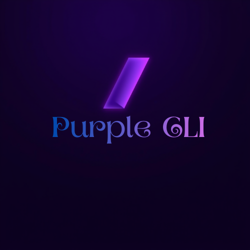

# 💜 Purple CLI — VS Code Theme

<div align="center">



### A sleek, purple-focused dark theme for Visual Studio Code with a clean, modern CLI feel.

[](https://marketplace.visualstudio.com/items?itemName=krishkoli.krish)
[](https://github.com/kolikrish/Purple-CLI/releases)
[](./LICENSE)
[](https://github.com/kolikrish)

---

</div>

## ✨ Overview

**Purple CLI** is a meticulously crafted dark theme designed for developers who love deep, immersive dark backgrounds, rich neon purple accents, and sharp syntax contrast. Inspired by terminal/CLI aesthetics, it provides a distraction-free, eye-friendly environment for long coding sessions across all major programming languages.

---

## 🎨 Color Palette & Aesthetic

| UI Element | Color Hex | Visual Tone |
| :--- | :--- | :--- |
| **Editor Background** | `#0a0813` | Deep Midnight Dark |
| **Gutter / Panel** | `#06040a` | Ultra Dark Contrast |
| **Primary Accent** | `#975ff0` | Electric Purple |
| **Sidebar / Tab Active**| `#241638` | Dark Plum |
| **Vivid Cursor** | `#f904e9` | Neon Magenta |
| **Syntax Highlight** | High Contrast | Soft Cyan, Pastel Red, Mint Green & Soft Yellow |

---

## 🚀 Features

- 👁️ **Eye-Friendly Dark Mode**: Ultra-deep `#0a0813` background minimizes eye fatigue during late-night coding.
- ⚡ **Vivid Neon Accents**: Vibrant purple (`#975ff0`) and magenta (`#f904e9`) highlights bring UI components to life.
- 🧬 **Semantic Highlighting**: Built-in semantic token colors for precise code understanding across TypeScript, Rust, Python, Go, and C/C++.
- 🎨 **CLI-Inspired Aesthetics**: Clean sidebar borders, high-contrast status bars, and crisp breadcrumbs for a terminal-like environment.
- 🛠️ **Full Extension Compatibility**: Seamless styling for Git decorations, Peek views, Diff editor, Terminal, and Suggest widgets.

---

## 📥 Installation

### Method 1: VS Code Marketplace (Recommended)

1. Open **Visual Studio Code**.
2. Press <kbd>Ctrl</kbd> + <kbd>Shift</kbd> + <kbd>X</kbd> (or <kbd>Cmd</kbd> + <kbd>Shift</kbd> + <kbd>X</kbd> on macOS) to open the **Extensions** sidebar.
3. Search for **`Purple CLI`**.
4. Click **Install**.

### Method 2: VS Code Quick Open

1. Press <kbd>Ctrl</kbd> + <kbd>P</kbd> (or <kbd>Cmd</kbd> + <kbd>P</kbd> on macOS).
2. Paste the following command and hit **Enter**:
   ```shell
   ext install krishkoli.krish
   ```

---

## ⚙️ How to Activate

1. Go to **File** ＞ **Preferences** ＞ **Color Theme** (or press <kbd>Ctrl</kbd> + <kbd>K</kbd>, then <kbd>Ctrl</kbd> + <kbd>T</kbd>).
2. Select **Purple CLI** from the list.

---

## 💡 Recommended Settings

For the ultimate terminal-inspired coding experience, add these settings to your `settings.json`:

```json
{
  "workbench.colorTheme": "Purple CLI",
  "editor.fontFamily": "'JetBrains Mono', 'Fira Code', 'Cascadia Code', monospace",
  "editor.fontLigatures": true,
  "editor.cursorBlinking": "smooth",
  "editor.cursorSmoothCaretAnimation": "on",
  "editor.semanticHighlighting.enabled": true
}
```

---

## 👥 Author & Community

Crafted with 💜 by **Krish Koli** ([@kolikrish](https://github.com/kolikrish)).

- 🌟 **Star this repository** on [GitHub](https://github.com/kolikrish/Purple-CLI) if you like the theme!
- 🐛 Found a bug or have a suggestion? Open an [Issue](https://github.com/kolikrish/Purple-CLI/issues).
- 💬 Follow Krish's #FOSS work on GitHub: [@kolikrish](https://github.com/kolikrish).

---

## 📄 License

This project is licensed under the [MIT License](LICENSE).


